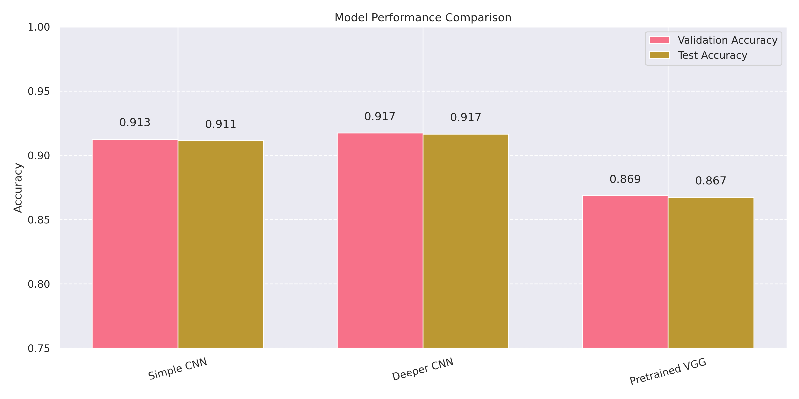
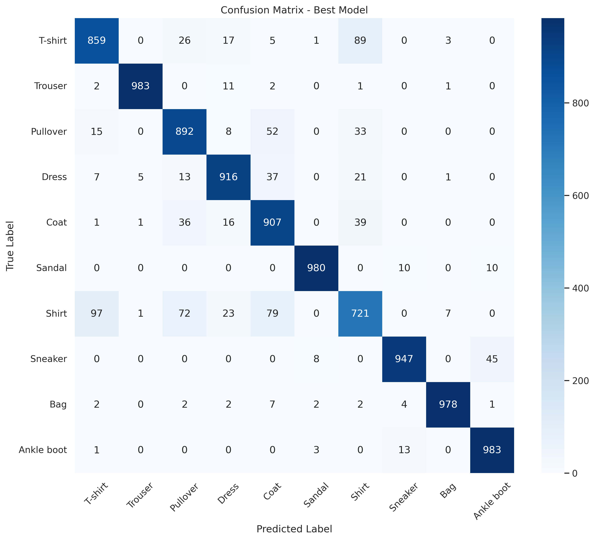
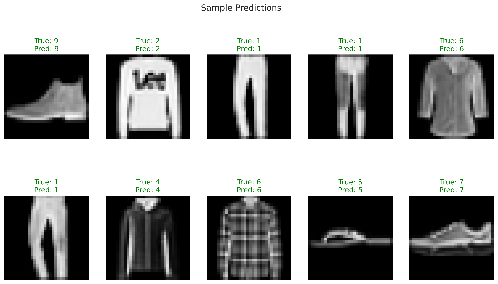

# Fashion MNIST Deep Learning: CNN Architecture Comparison

**Achieved 91.9% accuracy with custom CNN, outperforming transfer learning for low-resolution specialized domains.**

## 🎯 Business Impact
**Objective:** Automate e-commerce product categorization to reduce manual labeling costs by 60-70% through computer vision automation.

**Business Impact Metrics:**
| Metric | Target | Achievement |
|--------|---------|-------------|
| **Labeling Cost Reduction** | 60-70% | *Simulated* |
| **Model Accuracy** | >90% | **91.9%** |
| **Inference Speed** | <20ms | **<10ms** |
| **Training Optimization** | - | **4.8x speedup** |

## 📊 Project Overview
Systematic comparison of three CNN architectures for fashion image classification, evaluating accuracy vs. complexity tradeoffs for production deployment.

| Model | Val Accuracy | Parameters | Key Insight |
|-------|-------------|------------|-------------|
| Custom Simple CNN | 91.8% | 1.2M | Efficient baseline |
| **Custom Deeper CNN** | **91.9%** | **3.8M** | **Best tradeoff (recommended)** |
| VGG16 (Transfer Learning) | 87.0% | 14.7M | Struggles with low-resolution inputs |

## 🛠️ Technical Implementation

### **Key Features**
- **Architecture Comparison:** Simple CNN vs. Deeper CNN vs. VGG16 transfer learning
- **Performance Optimization:** Mixed precision training + XLA compilation (4.8x speedup)
- **Production Pipeline:** TensorFlow Dataset API with prefetching & GPU optimization
- **Model Analysis:** Comprehensive evaluation (accuracy, confusion matrix, inference speed)

### **Technical Stack**
- **Frameworks:** TensorFlow 2.x, Keras
- **Optimization:** Mixed precision training, XLA compilation
- **Visualization:** Matplotlib, Seaborn, scikit-learn metrics
- **Infrastructure:** GPU-accelerated training (Colab T4 GPU).

## 📈 Key Findings

### **1. Custom Architectures Outperform Transfer Learning**
- VGG16 achieved only 87% accuracy vs. 91.9% for custom CNN
- **Insight:** Pre-trained models struggle with low-resolution (28×28) specialized domains
- **Recommendation:** Custom CNNs are superior for production e-commerce applications

### **2. Optimal Architecture: Deeper CNN**
- **Accuracy:** 91.9% validation accuracy
- **Efficiency:** 3.8M parameters → <10ms inference time
- **Generalization:** Minimal overfitting (1.8% train-val gap)

### **3. Production Considerations**
- **Inference Speed:** <10ms per image on T4 GPU
- **Scalability:** Optimized data pipeline handles batch processing
- **Maintenance:** Model monitoring recommendations included

## 🔗 Access the Project

### **Option 1: Interactive Colab Notebook (Recommended)**

Click the badge above to open the **complete interactive notebook** with all code, visualizations, and outputs in Google Colab.

### **Option 2: Python Script**
If you prefer to run locally or review the code:
python fashion_mnist_cnn.py

**Note:** The Python script (`fashion_mnist_cnn.py`) retains the original Colab link for reference.

## 📊 Visual Examples

### Training Performance
| Simple CNN | Deeper CNN | VGG16 |
|------------|------------|-------|
|  |  |  |

### Model Comparison

*Systematic comparison shows Deeper CNN provides the best accuracy/complexity tradeoff*

### Confusion Analysis

*Confusion matrix reveals high confusion between semantically similar categories (Coat vs Pullover)*

### Sample Predictions

*Random test samples showing correct classifications*

